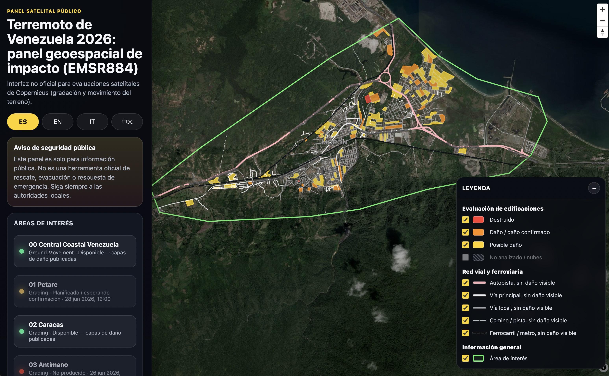

# Venezuela Earthquake Copernicus Data GIS Dashboard 2026

Unofficial public dashboard for the 2026 Venezuela earthquake response context, using public Copernicus EMS Rapid Mapping data for activation **EMSR884**.




## Purpose

This project translates public Copernicus EMS Rapid Mapping data into a lightweight, mobile-friendly, multilingual web dashboard.

The dashboard is designed for public situational awareness. It helps non-specialist users view Copernicus satellite-derived grading layers, AOI status, map context, and data freshness without needing GIS desktop software.

The project started as a Caracas / AOI02 prototype and has now been expanded into a dynamic EMSR884 AOI dashboard.

## Live demo to visit:

https://yin-renlong.github.io/venezuela-earthquake-copernicus-data-dashboard-2026/

## Important disclaimer

This dashboard is for public information only.

It is **not** an official rescue, evacuation, emergency response, government, military, medical, or civil-protection command tool.

Always follow local authorities, emergency services, and official humanitarian coordination channels.

Copernicus damage classes are remote satellite assessments. They may require field verification and may not reflect the latest ground conditions.

## Current activation coverage (26 June 2026)

The dashboard reads AOIs dynamically from the EMSR884 manifest.

Current AOIs listed by the activation include:

- AOI00 Central Coastal Venezuela
- AOI01 Petare
- AOI02 Caracas
- AOI03 Antimano
- AOI04 Maracay
- AOI05 Santa Cruz
- AOI06 Moron
- AOI07 Puerto Cabello
- AOI08 San Felipe
- AOI09 Valencia
- AOI10 Guacara
- AOI11 Villa de Cura
- AOI12 Caraballeda

AOIs with published public vector layers are shown as available. AOIs that are planned, in progress, waiting confirmation, or not produced are shown as placeholders until Copernicus publishes usable public layers.

At the time of this update, completed public grading vector layers are available for:

- **AOI00 Central Coastal Venezuela** (Ground Movement)
- **AOI02 Caracas** (Grading)
- **AOI06 Moron** (Grading)

This can change as Copernicus updates the official activation.

## Data source

Official Copernicus EMSR884 public activation API:

```text
https://rapidmapping.emergency.copernicus.eu/backend/dashboard-api/public-activations/?code=EMSR884
```

Copernicus EMS Rapid Mapping website:

```text
https://rapidmapping.emergency.copernicus.eu/
```

The dashboard reads the live public activation manifest from Copernicus and then selects public layer URLs from the AOI product metadata.


## Copernicus EMSR884 API structure and developer interpretation notes

This project uses the official public Copernicus EMS Rapid Mapping activation endpoint:

```text
https://rapidmapping.emergency.copernicus.eu/backend/dashboard-api/public-activations/?code=EMSR884
```

The dashboard does **not** use local downloaded files in production. Local ZIP/JSON files were only used during development to understand the schema and verify layer attributes. The live dashboard reads the official Copernicus manifest and layer URLs from the public API.

### High-level API structure

The EMSR884 endpoint returns a JSON response with this general shape:

```json
{
  "count": 1,
  "next": null,
  "previous": null,
  "results": [
    {
      "code": "EMSR884",
      "name": "Earthquake in Venezuela",
      "reason": "...",
      "category": "Earthquake",
      "subCategory": "Ground shaking",
      "eventTime": "2026-06-24T16:04:00",
      "activationTime": "2026-06-25T03:51:00",
      "closed": false,
      "countries": [
        {
          "name": "Venezuela"
        }
      ],
      "aois": [],
      "reportLink": "...",
      "productsPath": "...",
      "aws_bucket": "..."
    }
  ]
}
```

For this dashboard, the most important top-level path is:

```text
results[0].aois
```

Each AOI contains its name, AOI number, geometry extent, products, and sometimes a BLP path.

### AOI structure

Each AOI generally looks like this:

```json
{
  "name": "Caracas",
  "number": 2,
  "activationCode": "EMSR884",
  "extent": "POLYGON ((...))",
  "products": [],
  "blpPath": "https://rapidmapping.emergency.copernicus.eu/backend/EMSR884/AOI02/EMSR884_AOI02_BLP.zip"
}
```

Important AOI fields:

| Field      | Meaning                                 | Dashboard use                        |
| ---------- | --------------------------------------- | ------------------------------------ |
| `name`     | AOI display name                        | Sidebar AOI label                    |
| `number`   | AOI number                              | Direct link via `?aoi=NUMBER`        |
| `extent`   | AOI polygon in WKT format               | Map fit bounds and green AOI outline |
| `products` | Product list for this AOI               | Used to find usable GRA/GRM products |
| `blpPath`  | Baseline product ZIP path, if available | Currently informational / future use |

The dashboard reads all AOIs dynamically instead of hard-coding only Caracas or Moron.

Observed EMSR884 AOIs include:

|   AOI | Name                      |
| ----: | ------------------------- |
| AOI00 | Central Coastal Venezuela |
| AOI01 | Petare                    |
| AOI02 | Caracas                   |
| AOI03 | Antimano                  |
| AOI04 | Maracay                   |
| AOI05 | Santa Cruz                |
| AOI06 | Moron                     |
| AOI07 | Puerto Cabello            |
| AOI08 | San Felipe                |
| AOI09 | Valencia                  |
| AOI10 | Guacara                   |
| AOI11 | Villa de Cura             |
| AOI12 | Caraballeda               |

### Product structure

Each AOI contains one or more products. A product generally looks like this:

```json
{
  "id": 2600,
  "type": "GRA",
  "monitoring": false,
  "monitoringNumber": 0,
  "feasible": true,
  "images": [],
  "stats": {},
  "mapsCount": 1,
  "activationCode": "EMSR884",
  "aoiName": "Caracas",
  "aoiNumber": 2,
  "extent": "POLYGON ((...))",
  "expectedDelivery": "2026-06-26T05:00:00",
  "layers": [],
  "downloadPath": "https://rapidmapping.emergency.copernicus.eu/backend/EMSR884/AOI02/GRA_PRODUCT/EMSR884_AOI02_GRA_PRODUCT_v1.zip",
  "version": {
    "uuid": "...",
    "number": 1,
    "reason": "",
    "deliveryTime": "2026-06-26T04:01:10.948274",
    "statusCode": "F"
  }
}
```

Important product fields:

| Field                  | Meaning                             | Dashboard use                      |
| ---------------------- | ----------------------------------- | ---------------------------------- |
| `id`                   | Copernicus product ID               | Data status panel                  |
| `type`                 | Product type, e.g. `GRA`, `GRM`     | Product selection                  |
| `monitoring`           | Whether this is a monitoring update | Product label                      |
| `monitoringNumber`     | Monitoring sequence number          | Product label                      |
| `images`               | Source satellite images             | Acquisition time display           |
| `expectedDelivery`     | Expected product delivery           | Placeholder status                 |
| `layers`               | Public layer list                   | Main source for map layer URLs     |
| `downloadPath`         | Product ZIP download                | Data source link                   |
| `version.deliveryTime` | Actual delivery/publication time    | Data freshness                     |
| `version.statusCode`   | Product status                      | AOI availability/placeholder state |

### Product types observed

| Type  | Meaning                             | Dashboard handling                                           |
| ----- | ----------------------------------- | ------------------------------------------------------------ |
| `GRA` | Grading / damage assessment product | Main product type used for built-up, transportation, and not-analysed layers |
| `GRM` | Ground Movement product             | Displayed as product status / placeholder where relevant     |

### Product status codes observed

The API uses short status codes in:

```text
product.version.statusCode
```

Observed meanings during EMSR884 development:

| Status code | Interpreted meaning                      | Dashboard behavior                                  |
| ----------- | ---------------------------------------- | --------------------------------------------------- |
| `F`         | Finished / completed                     | AOI can be active if usable public layers exist     |
| `I`         | In progress                              | AOI shown as placeholder unless usable layers exist |
| `W`         | Waiting / planned / waiting confirmation | AOI shown as placeholder                            |
| `N`         | Not produced                             | AOI shown as unavailable / not produced             |

The dashboard does not rely only on status code. It also checks whether usable layer URLs exist.

A product with `statusCode: "F"` but no usable public vector layers should still be treated cautiously. A product with `layers: []` is not directly displayable by this dashboard.

### Product selection logic

For a selected AOI, the dashboard tries to choose the most useful product in this order:

1. `GRA` product with `statusCode: "F"` and usable public vector layers
2. Any `GRA` product with usable public vector layers
3. Any finished product with usable public vector layers
4. Any product with usable public vector layers
5. In-progress or waiting `GRA` product as placeholder metadata
6. First available product as fallback metadata

This lets the UI show AOIs even before public layers are available.

### Layer structure inside a product

A completed grading product may contain layers like this:

```json
{
  "name": "EMSR884/AOI02/GRA_PRODUCT/EMSR884_AOI02_GRA_PRODUCT_builtUpA_v1_VT",
  "format": "vt",
  "sld": "https://rapidmapping-viewer.s3.eu-west-1.amazonaws.com/EMSR884/AOI02/GRA_PRODUCT/EMSR884_AOI02_GRA_PRODUCT_builtUpA_v1.sld",
  "json": "https://rapidmapping-viewer.s3.eu-west-1.amazonaws.com/EMSR884/AOI02/GRA_PRODUCT/EMSR884_AOI02_GRA_PRODUCT_builtUpA_v1.json"
}
```

Important layer fields:

| Field    | Meaning                        | Dashboard use                                    |
| -------- | ------------------------------ | ------------------------------------------------ |
| `name`   | Layer path/name                | Used to classify layer type                      |
| `format` | Layer format, e.g. `vt`, `cog` | `vt` layers are used for vector display          |
| `sld`    | Official style descriptor      | Used during development to verify legend classes |
| `json`   | GeoJSON or TileJSON endpoint   | Main map source URL                              |

The dashboard currently looks for these layer names:

| Layer key         | Copernicus layer naming pattern | Dashboard use                                  |
| ----------------- | ------------------------------- | ---------------------------------------------- |
| `builtUpA`        | `builtUpA`                      | Built-up grading polygons                      |
| `transportationL` | `transportationL`               | Road/rail line network                         |
| `notAnalysedA`    | `notAnalysedA`                  | Not-analysed polygons / cloud-obstructed areas |

The product ZIP may also include additional files such as:

| Layer/file                         | Meaning                    | Current dashboard status                                     |
| ---------------------------------- | -------------------------- | ------------------------------------------------------------ |
| `areaOfInterestA`                  | Official AOI polygon layer | The dashboard currently uses AOI WKT `extent` from the API instead |
| `imageFootprintA`                  | Satellite image footprint  | Not currently displayed                                      |
| `source`                           | Source metadata            | Not currently displayed                                      |
| `*.sld`                            | Official styling           | Used to verify styling rules                                 |
| `*.xml`                            | Metadata                   | Not currently displayed                                      |
| `*.shp`, `*.dbf`, `*.shx`, `*.prj` | Shapefile components       | Not used directly in the browser dashboard                   |

### GeoJSON vs TileJSON handling

The Copernicus `json` URL may point to either:

1. Raw GeoJSON / FeatureCollection
2. TileJSON for vector tiles

The dashboard auto-detects both.

GeoJSON-like response:

```json
{
  "type": "FeatureCollection",
  "features": []
}
```

TileJSON-like response:

```json
{
  "tilejson": "2.2.0",
  "tiles": [
    "..."
  ],
  "vector_layers": [
    {
      "id": "..."
    }
  ]
}
```

For TileJSON, the dashboard resolves tile URLs and detects the vector source layer from `vector_layers`.

### AOI boundary handling

The API provides AOI geometry as WKT:

```text
POLYGON ((lng lat, lng lat, ...))
```

The dashboard parses this WKT polygon to:

1. fit the map to the selected AOI
2. draw a green AOI outline on the map
3. allow the AOI outline to be toggled from the map legend

This means the dashboard does not need to wait for `areaOfInterestA` vector layers to show the AOI boundary.

### Built-up layer interpretation

The built-up grading layer is expected to contain building or built-up-area damage classes.

The dashboard defensively checks several possible damage fields, including:

```text
damage_gra
damage_grade
Damage_Grade
DAMAGE_GRA
damage
Damage
```

Observed / expected damage values include:

```text
Destroyed
Damaged
Possibly damaged
No visible damage
```

The dashboard displays:

| Damage class     | Style  |
| ---------------- | ------ |
| Destroyed        | Red    |
| Damaged          | Orange |
| Possibly damaged | Yellow |

No-visible-damage built-up features are filtered out from the main damage overlay so that the map focuses on visible damage classes.

### Not-analysed layer interpretation

The `notAnalysedA` layer represents areas that were not analysed, often because of cloud cover, obstruction, or unavailable satellite visibility.

Dashboard behavior:

- off by default
- user-toggleable from the map legend
- displayed as a grey hatched polygon layer when enabled

This avoids overwhelming the satellite basemap while still allowing users to inspect not-analysed areas.

### Transportation layer interpretation

The `transportationL` layer is a line layer for road and rail features.

During development, local downloaded Copernicus product files were used only to inspect schema and verify styling. For AOI02, the downloaded GRA transportation file had this structure:

```text
File:
EMSR884_AOI02_GRA_PRODUCT_transportationL_v1.json

Feature count:
9135

Property keys:
obj_type
name
info
simplified
damage_gra
det_method
notation
or_src_id
dmg_src_id
cd_value
```

Important fields for transportation styling:

| Field        | Meaning                                                      |
| ------------ | ------------------------------------------------------------ |
| `simplified` | Simplified transport class                                   |
| `info`       | More detailed transport code/class                           |
| `obj_type`   | Broad object type, e.g. roads or railways                    |
| `damage_gra` | Damage/analysis status                                       |
| `det_method` | Detection method                                             |
| `cd_value`   | Copernicus damage-related field, often not applicable for no-damage transport |

For AOI02 GRA transportation, observed `simplified` values were:

| `simplified` value | Count |
| ------------------ | ----: |
| `Local roads`      |  6283 |
| `Main roads`       |  2158 |
| `Highway`          |   622 |
| `Subways`          |    46 |
| `Tracks`           |    22 |
| `Railways`         |     4 |

Observed `info` values were:

| `info` value                  | Count |
| ----------------------------- | ----: |
| `21122-Local Road`            |  6283 |
| `21120-Primary Road`          |  1395 |
| `21121-Secondary Road`        |   763 |
| `2111-Highways`               |   622 |
| `21221-Subway`                |    46 |
| `21124-Cart Track`            |    22 |
| `2121-Long-distance railways` |     4 |

Observed `damage_gra` values were:

| `damage_gra` value  | Count |
| ------------------- | ----: |
| `Not Analysed`      |  5704 |
| `No visible damage` |  3431 |

The official SLD legend titles for the AOI02 GRA transportation layer included:

```text
Highway, No visible damage
Main road, No visible damage
Local road, No visible damage
Track, No visible damage
Railway, No visible damage
Subway, No visible damage
```

Dashboard transportation behavior:

- Transportation is separated into selectable sublayers.
- Highway is styled separately from other roads.
- Main road, local road, track, and railway/subway can be toggled independently.
- Railway and subway are grouped together in the public-facing legend.
- Features with `damage_gra: "Not Analysed"` are not displayed as `No visible damage`.
- Unknown/fallback road features should default to local-road styling, not highway styling.

Current public-facing transportation toggles:

| Toggle                              | Data classification                                          |
| ----------------------------------- | ------------------------------------------------------------ |
| Highway, No visible damage          | `simplified = Highway` or `info` contains highway class      |
| Main road, No visible damage        | `simplified = Main roads`, or primary/secondary road in `info` |
| Local road, No visible damage       | `simplified = Local roads`, or local road in `info`, plus safe fallback |
| Track, No visible damage            | `simplified = Tracks`, or cart track in `info`               |
| Railway / subway, No visible damage | `simplified = Railways` or `Subways`, or railway/subway in `info`/`obj_type` |

### BLP vs GRA product note

Some AOIs include a BLP ZIP path:

```text
blpPath
```

BLP transportation data may contain baseline road/rail classes but not grading damage fields such as `damage_gra`.

For example, the AOI02 BLP transportation file had fields such as:

```text
obj_type
name
info
simplified
det_method
notation
or_src_id
```

The GRA product transportation file included additional grading fields:

```text
damage_gra
dmg_src_id
cd_value
```

For the live dashboard, GRA products are preferred because they include the grading context needed for the public legend.

### Data status and freshness interpretation

The dashboard displays several timestamps:

| Field                          | Meaning                                                      |
| ------------------------------ | ------------------------------------------------------------ |
| `product.version.deliveryTime` | When Copernicus delivered/published the product              |
| `product.expectedDelivery`     | Expected delivery time if product is not finished            |
| `images[].acquisitionTime`     | Satellite image acquisition time                             |
| dashboard `lastChecked`        | When the browser last checked the Copernicus manifest        |
| dashboard `successfulLoadTime` | When the selected AOI layers were successfully loaded in the dashboard |

The dashboard uses browser local storage to cache the Copernicus manifest for 30 minutes.

Maintainer refresh parameters:

```text
?refresh=1
?forceRefresh=1
?nocache=1
```

Example:

```text
https://yin-renlong.github.io/venezuela-earthquake-copernicus-data-dashboard-2026/?refresh=1&aoi=6
```

### Direct AOI linking

The dashboard supports AOI direct links using:

```text
?aoi=NUMBER
```

Examples:

```text
?aoi=2
?aoi=6
```

This is useful when sharing a direct view of Caracas, Moron, or any future AOI that receives usable public vector layers.

### Development workflow for future AOI/layer updates

When Copernicus updates the activation:

1. Open the dashboard with `?refresh=1`.
2. Check the AOI list in the sidebar.
3. If a new AOI has public vector layers, the dashboard should detect it automatically.
4. If layers do not display, inspect the AOI product `layers[]` array in the official manifest.
5. Confirm whether the layer names still include `builtUpA`, `transportationL`, or `notAnalysedA`.
6. Open the layer `json` URL and check whether it is GeoJSON or TileJSON.
7. If styling fails, download the official product ZIP and inspect:
   - `.json` attribute fields
   - `.sld` legend rules
   - unique values in relevant fields

Useful fields to inspect for transportation layers:

```text
simplified
info
obj_type
damage_gra
```

Useful fields to inspect for built-up layers:

```text
damage_gra
damage_grade
Damage_Grade
DAMAGE_GRA
damage
Damage
```

### Suggested local schema inspection command

During development, the following kind of local inspection can help verify downloaded product ZIP contents. This is not used by the live dashboard.

```bash
python3 <<'PY'
from pathlib import Path
import json
from collections import Counter, defaultdict

root = Path("/Users/Renlong/Downloads/EMSR884")
files = sorted(root.glob("**/*transportationL_v1.json"))

for path in files:
    print("=" * 80)
    print(path)

    data = json.loads(path.read_text())
    features = data.get("features", [])

    print("Feature count:", len(features))

    key_counts = Counter()
    values_by_key = defaultdict(Counter)

    for feature in features:
        props = feature.get("properties") or {}

        for key, value in props.items():
            key_counts[key] += 1
            if value not in (None, ""):
                values_by_key[key][str(value)] += 1

    print("\nProperty keys:")
    for key, count in key_counts.most_common():
        print(f"  {key}: {count}")

    print("\nSmall unique-value fields:")
    for key in sorted(values_by_key):
        values = values_by_key[key]
        if 1 <= len(values) <= 30:
            print(f"\n  {key}:")
            for value, count in values.most_common(30):
                print(f"    {value!r}: {count}")
PY
```

### Important caution for future contributors

The official Copernicus API is the source of truth. This dashboard is only a public-facing interface over selected public data.

Future contributors should avoid:

- treating satellite-derived damage classes as field-verified ground truth
- presenting this dashboard as an emergency response or evacuation tool
- mixing not-analysed features into no-damage categories
- collecting personal, rescue, casualty, or medical data
- depending on local downloaded files for the production dashboard
- assuming layer schemas will never change

If Copernicus changes layer field names or styling rules, inspect the official `json` and `sld` files again and update the dashboard filters accordingly.


## Direct AOI links

Default dashboard:

```text
https://yin-renlong.github.io/venezuela-earthquake-copernicus-data-dashboard-2026/
```

Open Caracas / AOI02:

```text
https://yin-renlong.github.io/venezuela-earthquake-copernicus-data-dashboard-2026/?aoi=2
```

Open Moron / AOI06:

```text
https://yin-renlong.github.io/venezuela-earthquake-copernicus-data-dashboard-2026/?aoi=6
```

Force a fresh Copernicus manifest check:

```text
https://yin-renlong.github.io/venezuela-earthquake-copernicus-data-dashboard-2026/?refresh=1
```

Open Moron and force refresh:

```text
https://yin-renlong.github.io/venezuela-earthquake-copernicus-data-dashboard-2026/?refresh=1&aoi=6
```

## Features

- Static public web dashboard hosted on GitHub Pages
- Live Copernicus EMSR884 manifest loading
- Dynamic AOI selector for all EMSR884 AOIs
- Placeholder AOI cards for planned, in-progress, waiting, or not-produced products
- AOI direct linking with `?aoi=NUMBER`
- Maintainer cache bypass with `?refresh=1`
- Multilingual UI:
  - Spanish
  - English
  - Italian
  - Chinese
- Mobile-friendly responsive layout
- MapLibre GL JS interactive map
- Satellite basemap
- Street-map basemap switch
- Optional street labels over satellite imagery
- Data freshness panel
- Copernicus delivery time display
- Satellite acquisition time display
- Last checked time display
- Last successful dashboard load time display
- Browser-side Copernicus manifest cache
- Map legend moved onto the map for faster visual interpretation
- Layer toggles directly in the map legend
- Green Area of Interest outline for the selected AOI
- Public Copernicus product/report/download links where available

## Copernicus layers used

The dashboard currently uses these public Copernicus layer groups when they are available for an AOI:

- `builtUpA`
- `transportationL`
- `notAnalysedA`

The dashboard automatically detects whether the Copernicus JSON is:

- raw GeoJSON / FeatureCollection, or
- TileJSON for vector tiles

No Mapbox token is required.

## Built-up grading

The built-up grading layer is styled as:

- Destroyed
- Damaged
- Possibly damaged

The dashboard filters out no-damage building classes from the built-up damage overlay so that the map focuses on relevant visible damage grades.

## Transportation / road and rail network

The transportation legend is split into selectable sublayers:

- Highway, No visible damage
- Main road, No visible damage
- Local road, No visible damage
- Track, No visible damage
- Railway / subway, No visible damage

The EMSR884 transportation data uses attributes such as:

- `simplified`
- `info`
- `damage_gra`

For the tested AOI02 transportation layer, Copernicus exposes values such as:

- `Highway`
- `Main roads`
- `Local roads`
- `Tracks`
- `Railways`
- `Subways`

The dashboard uses these fields to separate the transportation classes. Transport features marked `Not Analysed` are not displayed as `No visible damage`.

Railway and subway are grouped under one public-facing railway toggle because the current Copernicus legend includes both railway and subway transport classes.

## Not analysed layer

The `notAnalysedA` layer represents areas that were not analysed, for example because of cloud cover, obstruction, or unavailable satellite visibility.

It is:

- off by default
- available as a user-controlled toggle
- shown with a grey hatched style when enabled

This avoids visually overwhelming the satellite basemap while still allowing users to inspect unavailable analysis areas when needed.

## AOI placeholders

The dashboard does not hard-code only one city.

It reads all AOIs from the Copernicus activation manifest and renders them in the sidebar.

If an AOI has not yet received public vector layers, it remains visible as a placeholder. When Copernicus later publishes usable public layers, the AOI can become active without redesigning the interface.

Status labels are based on Copernicus product metadata, including product status and expected delivery where available.

## Data freshness and cache behavior

The dashboard checks the official Copernicus activation manifest and caches it in the browser.

Default cache duration:

```text
30 minutes
```

Maintainer refresh parameters:

```text
?refresh=1
?forceRefresh=1
?nocache=1
```

Examples:

```text
http://localhost:8080/?refresh=1
```

```text
http://localhost:8080/?refresh=1&aoi=6
```

The cache only stores the public Copernicus manifest in the user's browser local storage. It does not store personal data.

## Basemaps

The dashboard currently includes:

- Esri World Imagery satellite basemap
- OpenStreetMap-based street basemap for prototype use
- CARTO label tiles for street names over satellite mode

## Basemap note

OpenStreetMap public tiles are used here for prototype testing only.

If this project receives large public traffic, the street-map source should be replaced with one of the following:

- a production tile provider
- self-hosted map tiles
- a humanitarian-supported tile provider
- an approved emergency mapping infrastructure provider

This is important to respect public tile usage policies.

## Tech stack

- GitHub Pages
- Vanilla HTML
- Vanilla CSS
- Vanilla JavaScript
- MapLibre GL JS
- Public Copernicus EMSR884 activation API
- Public Copernicus vector/GeoJSON/TileJSON layer data
- Esri World Imagery
- OpenStreetMap / CARTO tiles for prototype basemap context

## Local development

Start a local server:

```bash
python3 -m http.server 8080
```

Open the dashboard:

```text
http://localhost:8080
```

Open Caracas / AOI02:

```text
http://localhost:8080/?aoi=2
```

Open Moron / AOI06:

```text
http://localhost:8080/?aoi=6
```

Force fresh Copernicus manifest loading:

```text
http://localhost:8080/?refresh=1
```

Force refresh and open Moron:

```text
http://localhost:8080/?refresh=1&aoi=6
```

## Development notes

The project is intentionally static and lightweight.

There is no backend server, no database, no user account system, and no private API key.

The dashboard should remain easy to mirror, audit, and redeploy during a humanitarian information situation.

## Ethical scope

This project does **not** collect, store, process, or display:

- casualty data
- missing-person data
- rescue request data
- evacuation request data
- medical data
- private personal data
- phone numbers
- household-level reports
- user-submitted emergency information

The dashboard is an unofficial public-interest interface for viewing public Copernicus EMSR884 satellite-derived mapping data.

## Authorship and status

Built by **YIN Renlong** as an unofficial public-interest interface using public Copernicus EMSR884 data.

This project is independent and unofficial. It is not endorsed by Copernicus, the European Commission, local authorities, or emergency response agencies.


## Development log

**[26 June 2026]**

This section records the main design thinking, debugging, and implementation changes made on **26 June 2026** while extending the dashboard beyond the original grading-focused workflow.

### 1. Problem discovered: AOI00 was available but displayed no data

During testing, **AOI00 Central Coastal Venezuela** appeared as an available AOI because the Copernicus EMSR884 API reported a completed product. However, clicking the AOI in the dashboard produced no visible map data.

The reason was that AOI00 did not contain the same grading product structure used by AOI02 Caracas and AOI06 Moron. Instead of a normal `GRA` grading product with layers such as:

```text
builtUpA
transportationL
notAnalysedA
```

AOI00 contained a **GRM / Ground Movement** product with a layer named:

```text
groundMovementA
```

The dashboard’s previous logic only recognized grading-related layers. Therefore, AOI00 was correctly detected as having a finished product, but the product layer itself was not understood or styled by the application.

### 2. Copernicus API and downloaded product comparison

The Copernicus public API exposed the AOI00 ground movement layer in the product metadata, for example:

```text
EMSR884/AOI00/GRM_PRODUCT/EMSR884_AOI00_GRM_PRODUCT_groundMovementA_v1_VT
```

The locally downloaded Copernicus product ZIP contained matching files, including:

```text
EMSR884_AOI00_GRM_PRODUCT_groundMovementA_v1.json
EMSR884_AOI00_GRM_PRODUCT_groundMovementA_v1.shp
EMSR884_AOI00_GRM_PRODUCT_groundMovementA_v1.sld
EMSR884_AOI00_GRM_PRODUCT_groundMovementA_v1.tif
```

Inspection of the local GeoJSON showed that the important styling attribute for ground movement is:

```json
{
  "obj_desc": "LOS Displacement",
  "value": "0.05 to 0.1",
  "det_method": "Automatic extraction"
}
```

The `value` field contains the displacement class used by the official Copernicus legend.

Observed ground movement classes were:

```text
-0.5 to -0.2
-0.2 to -0.1
-0.1 to -0.05
-0.05 to 0
0 to 0.05
0.05 to 0.1
0.1 to 0.2
0.2 to 0.5
Above 0.5
```

This confirmed that the downloaded file and the online API layer describe the same product family, and that the dashboard needed a generic `groundMovementA` handler rather than an AOI00-specific workaround.

### 3. Design decision: support product types generically, not only AOI00

A key design decision was to avoid hard-coding AOI00.

The dashboard should support:

- AOIs that only have grading products.
- AOIs that only have ground movement products.
- AOIs that later receive both grading and ground movement products.
- Future grading monitoring products when Copernicus publishes usable public vector layers.
- Future AOIs and future product versions without requiring manual code changes for each AOI.

The implementation was therefore extended around layer type detection and product selection rather than around a single AOI number.

### 4. Ground movement layer support added

Support was added for the new Copernicus layer key:

```text
groundMovementA
```

The dashboard now detects this layer name from the Copernicus manifest and can load it from the public `json` URL.

A new MapLibre source was added:

```text
copernicus-ground-movement-a
```

New layer IDs are generated for each displacement class. Each class has a fill layer and outline layer, allowing visibility to be controlled class by class.

The dashboard styles ground movement polygons using the `value` property. The styling follows a blue-to-red displacement scale similar to the official Copernicus legend:

| Ground movement value | Color role                                      |
| --------------------- | ----------------------------------------------- |
| `-0.5 to -0.2`        | strong negative displacement, dark blue         |
| `-0.2 to -0.1`        | medium negative displacement, blue              |
| `-0.1 to -0.05`       | low negative displacement, light blue           |
| `-0.05 to 0`          | near-zero negative displacement, very pale blue |
| `0 to 0.05`           | near-zero positive displacement, pale yellow    |
| `0.05 to 0.1`         | low positive displacement, orange               |
| `0.1 to 0.2`          | medium positive displacement, orange-red        |
| `0.2 to 0.5`          | high positive displacement, red                 |
| `Above 0.5`           | very high positive displacement, dark red       |

### 5. Separate ground movement legend toggles

A new **Ground Movement** legend section was added to the map overlay.

Each displacement class is separately toggleable:

```text
-0.5 to -0.2
-0.2 to -0.1
-0.1 to -0.05
-0.05 to 0
0 to 0.05
0.05 to 0.1
0.1 to 0.2
0.2 to 0.5
Above 0.5
```

This followed the design idea that the legend should not only explain the colors, but also allow the user to isolate specific displacement ranges.

The legend is dynamic:

- If an AOI has no ground movement layer, the ground movement legend section is hidden.
- If an AOI has no transportation layer, the transportation legend section is hidden.
- If an AOI has no built-up grading layer, the built-up grading rows are hidden.
- If an AOI has a not-analysed layer, the not-analysed toggle is shown.
- The AOI outline toggle remains under general information when the AOI boundary is available.

This prevents the legend from showing irrelevant categories for the selected AOI.

### 6. Product selection logic improved

The earlier product selection logic primarily preferred finished `GRA` products. That worked for AOI02 Caracas and AOI06 Moron, but it was not enough for AOI00 because AOI00’s useful layer was in a `GRM` product.

The selection logic was updated so the dashboard can collect the best available product per layer key:

```text
builtUpA
transportationL
notAnalysedA
groundMovementA
```

This means a single selected AOI may use layer URLs from more than one product if Copernicus publishes multiple useful products for the same AOI.

The dashboard now scores products using:

- whether the product has useful public layers,
- product status code,
- product type (`GRA` or `GRM`),
- monitoring flag and monitoring number,
- product delivery time,
- expected delivery time,
- satellite acquisition time.

This helps the dashboard handle both initial products and future monitoring products more gracefully.

### 7. AOI00 now loads as a Ground Movement product

After adding `groundMovementA` support, AOI00 Central Coastal Venezuela can be opened directly:

```text
?aoi=0
```

The dashboard now loads the ground movement layer and displays it using the new displacement legend.

This fixes the earlier behavior where AOI00 appeared available but showed no usable data when selected.

### 8. Syntax issue found and repaired during patching

During the first code patch, a syntax issue was introduced:

```js
async async function loadAoi(...)
```

This happened because the replacement helper inserted a new `async function` while leaving the original `async` keyword in place.

The browser reported:

```text
Uncaught SyntaxError: Unexpected token 'async'
```

A repair patch replaced all occurrences of:

```js
async async function
```

with:

```js
async function
```

After this, the app loaded correctly again.

This debugging step led to a safer replacement helper that recognizes optional `async` prefixes when replacing JavaScript functions.

### 9. Large GeoJSON performance issue identified

AOI00’s ground movement GeoJSON is large, approximately tens of megabytes. The initial public URL tested was:

```text
https://rapidmapping-viewer.s3.eu-west-1.amazonaws.com/EMSR884/AOI00/GRM_PRODUCT/EMSR884_AOI00_GRM_PRODUCT_groundMovementA_v1.json
```

The dashboard originally used `cache: "no-store"` for all JSON fetches. This meant that when a user switched from AOI00 to another AOI and then back to AOI00, the browser could redownload the large ground movement JSON again.

This was identified as a poor design for users with limited bandwidth.

### 10. Browser-session JSON cache added

A practical browser-session cache was added for large Copernicus layer JSON documents.

The dashboard now keeps a memory cache keyed by layer URL:

```js
const JSON_DOCUMENT_MEMORY_CACHE = new Map();
```

When the same layer URL is requested again during the same browser tab/session, the dashboard reuses the already fetched and parsed JSON object instead of downloading it again.

This improves the common interaction:

```text
AOI00 → AOI02 → AOI00
```

The first AOI00 load still has to download the large file, but returning to AOI00 in the same session should reuse cached data.

### 11. Browser HTTP cache allowed for layer JSON

The manifest still uses freshness-oriented loading because it is small and may change. However, layer JSON URLs are versioned product URLs, so they can safely use normal browser HTTP caching.

Layer JSON fetches now use cache behavior appropriate for reusable versioned assets instead of forcing `no-store`.

Design principle:

- The manifest should be checked periodically.
- Large versioned layer files should be reused when the URL has not changed.
- If Copernicus publishes a new product version, the manifest should expose a new or updated layer URL.

### 12. Professional large-layer loading notice added

A user-facing notice was added for large ground movement layers.

When loading a potentially large Copernicus ground movement layer for the first time in the session, the dashboard shows a professional message explaining that the first load may take some time on slower connections and that cached data will be reused when possible during the same browser session.

English text:

```text
Loading large geospatial layer

Downloading a large Copernicus layer. The first load may take some time on slower connections; revisiting this AOI in the same browser session will reuse cached data when possible.
```

Equivalent translations were added in Spanish, Italian, and Chinese.

### 13. Optimization ideas considered but deferred

Several larger optimization ideas were considered.

#### Local raw GeoJSON mirror

One idea was to download the large Copernicus GeoJSON and host it in this repository or through GitHub Pages.

This was not implemented for now because it would still require users to download a large raw GeoJSON file. It would move the bandwidth source from Copernicus S3 to GitHub Pages, but it would not solve the fundamental first-load size problem.

#### GitHub Actions update pipeline

Another idea was to use GitHub Actions to periodically check the Copernicus manifest and mirror or optimize changed files.

This was deferred because the current priority was to keep the project simple and avoid adding an automated build/update pipeline.

#### Vector tiles or PMTiles

A stronger long-term solution would be to convert large GeoJSON layers into vector tiles or PMTiles.

This would allow progressive map loading by visible tile instead of downloading the full AOI layer at once. It would be technically better for large layers, but it adds complexity and was intentionally deferred for this iteration.

The current implementation remains a static browser-only dashboard with a simpler cache-based optimization.

### 14. Title and subtitle updated

The project title and subtitle were updated to better describe the broader scope of the dashboard now that it supports both grading and ground movement products.

New English title:

```text
Venezuela 2026 Earthquake: Geospatial Impact Dashboard (EMSR884)
```

New English subtitle:

```text
Unofficial interface for Copernicus satellite assessments (grading and ground movement).
```

The same concept was translated into Spanish, Italian, and Chinese in the UI.

The HTML `<title>` and meta description were also updated.

### 15. Current result after this iteration [26 June 2026]

After this development session, the dashboard supports:

- Dynamic AOI selection across EMSR884.
- Grading products (`GRA`) with built-up, transportation, and not-analysed layers.
- Ground movement products (`GRM`) with displacement classes.
- AOI00 Central Coastal Venezuela ground movement display.
- Class-by-class ground movement legend toggles.
- Dynamic legend visibility depending on the layers actually available for the selected AOI.
- Improved product selection across GRA, GRM, and monitoring products.
- Browser-session caching for large layer JSON files.
- A professional large-layer loading notice.
- Updated multilingual title and subtitle.

The dashboard still intentionally avoids:

- acting as an official emergency response tool,
- collecting rescue, casualty, or personal data,
- requiring a backend server,
- requiring a Mapbox token,
- requiring GitHub Actions or a preprocessing pipeline for the current version.

### 16. Remaining future improvement ideas

Potential future improvements include:

- persistent browser caching with Cache Storage or IndexedDB,
- optional PMTiles/vector-tile generation for very large layers,
- a lightweight data catalog for optimized static layers,
- better progress indication for very large downloads,
- popup inspection for ground movement polygons,
- more detailed handling of future Copernicus monitoring products,
- automated schema inspection tools for new product types.

These are future enhancements and were not implemented in this session.

